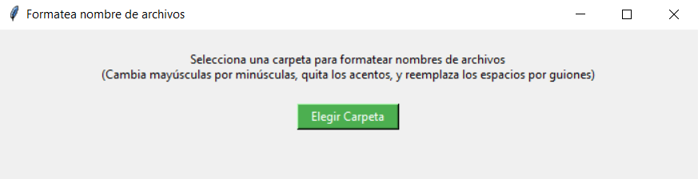

# Normalizador de Nombres de Archivos

Herramienta de escritorio desarrollada en Python para normalizar nombres de archivos masivamente. Convierte a minúsculas, elimina acentos y reemplaza espacios por guiones, generando automáticamente un reporte `.txt` con los resultados. Ideal para organizar archivos para la web o servidores.



## ✨ Características

- **Normalización masiva**: Procesa todos los archivos dentro de un directorio seleccionado.
- **Limpieza de formato**:
    - Convierte todo el nombre a minúsculas.
    - Elimina acentos y caracteres especiales (normalización NFKD ASCII).
    - Reemplaza espacios en blanco por guiones (`-`).
- **Reporte automático**: Genera un archivo `archivos_modificados.txt` dentro de la carpeta procesada con la lista de los nombres resultantes.
- **Interfaz sencilla**: Selección de carpeta fácil mediante ventana de diálogo (Tkinter).
- **Código abierto**: Script de Python modificable y adaptable.

## 🚀 Cómo usar

1.  Descarga el ejecutable desde la sección de [Releases](URL_A_TUS_RELEASES).
2.  O si prefieres usar el código fuente, asegúrate de tener Python instalado y ejecuta:
    ```bash
    python formatea-nombre-de-archivos.py
    ```
3.  Haz clic en el botón **"Elegir Carpeta"**.
4.  Selecciona el directorio que contiene los archivos que deseas renombrar.
5.  ¡Listo! El programa procesará los archivos y mostrará un mensaje de confirmación al finalizar.

## 🛠️ Desarrollo (Requisitos y Build)

### Requisitos
- Python 3.x
- Librería estándar `tkinter` (generalmente incluida con Python).

### Crear Ejecutable (Opcional)
Si deseas compilarlo como ejecutable para Windows, puedes usar PyInstaller:

```bash
pyinstaller --onefile --windowed formatea-nombre-de-archivos.py
```

## 📄 Licencia

Este proyecto está bajo la Licencia MIT. Consulta el archivo `LICENSE` para más detalles.